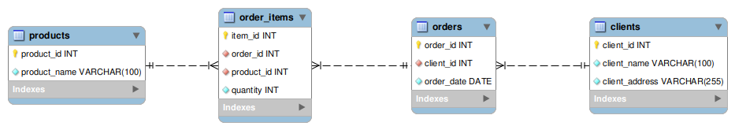
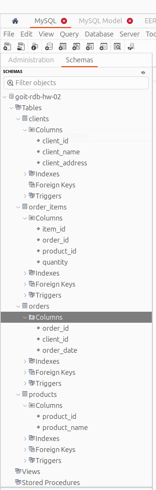

# [Домашнє завдання до Теми 2. Проектування баз даних з використанням семантичних моделей](https://www.edu.goit.global/learn/25315460/21808779/22222320/homework)

Список нормальних форм, кожен з яких встановлює певні вимоги до структури таблиць та залежностей між їхніми стовпцями:
- 1НФ (Перша нормальна форма): Кожен атрибут у таблиці повинен бути атомарним, тобто значення кожного атрибута повинно бути неподільним.
- 2НФ (Друга нормальна форма): Таблиця повинна бути в 1НФ, і всі неключові атрибути повністю мають залежати від ключового атрибута.
- 3НФ (Третя нормальна форма): Таблиця повинна бути в 2НФ, і всі неключові атрибути повинні бути взаємно незалежними один від одного.
- BCNF (Boyce-Codd Normal Form): Таблиця повинна бути в 3НФ, і всі неключові атрибути повинні повністю залежати від первинного ключа, не допускаючи транзитивних функціональних залежностей.
- 4НФ (Четверта нормальна форма): Таблиця повинна бути в BCNF, і не повинна мати множинних мультимножин атрибутів, які можуть визначати одне й те саме значення для ключа.
- 5НФ (П'ята нормальна форма): Таблиця повинна бути в 4НФ, і вона має виключати залежності між мультимножинами атрибутів, що не є ключем.

## Опис домашнього завдання

1. Переведіть початкову таблицю в першу нормальну форму.
2. Переведіть нові таблиці в другу нормальну форму.
3. Переведіть нові таблиці в третю нормальну форму.
4. Розробіть ER-діаграму отриманих таблиць.
5. Використовуючи ER-діаграму, створіть таблиці в базі даних. Оформіть ці таблиці без конкретних значень, тільки з урахуванням колонок та їхніх зв'язків, вручну або автоматично.

### Початкова таблиця

| Номер\_замовлення | Назва\_товару і кількість | Адреса\_клієнта | Дата\_замовлення | Клієнт    |
| ----------------- | ------------------------- | --------------- | ---------------- | --------- |
| 101               | Лептоп: 3, Мишка: 2       | Хрещатик 1      | 2023-03-15       | Мельник   |
| 102               | Принтер: 1                | Басейна 2       | 2023-03-16       | Шевченко  |
| 103               | Мишка: 4                  | Комп’ютерна 3   | 2023-03-17       | Коваленко |

### Критерії прийняття

1. Прикріплені посилання на репозиторій goit-rdb-hw-02 та безпосередньо самі файли репозиторію архівом.
2. Нормалізовано таблицю до 1НФ.
3. Нормалізовано таблицю до 2НФ.
4. Нормалізовано таблицю до 3НФ.

    💡 Результат нормалізації таблиць може бути в довільній формі/форматі (Google Doc, Google таблиці тощо).

5. Створено ER-діаграму отриманих таблиць. Діаграма має відповідати нормалізованим таблицям.

    💡 Має бути декілька таблиць зі зв’язком між ними. Результат може бути у вигляді файлу та/або скриншота.

6. Використано зрозумілі та конкретні імена для сутностей та атрибутів. Уточнено типи даних для атрибутів. Усі відношення й атрибути мають чіткі і зрозумілі кардинальності та значення.
7. Створено таблиці в базі даних (тільки таблиці й колонки з урахуванням зв'язків) вручну або автоматично.

    💡 Результат має бути у вигляді скріншота розгорнутої схеми у Workbench.

## Рішення
### Вхідна таблиця
| Номер\_замовлення | Назва\_товару і кількість | Адреса\_клієнта | Дата\_замовлення | Клієнт    |
| ----------------- | ------------------------- | --------------- | ---------------- | --------- |
| 101               | Лептоп: 3, Мишка: 2       | Хрещатик 1      | 2023-03-15       | Мельник   |
| 102               | Принтер: 1                | Басейна 2       | 2023-03-16       | Шевченко  |
| 103               | Мишка: 4                  | Комп’ютерна 3   | 2023-03-17       | Коваленко |

### 1НФ

| order\_number | item\_name | item\_count | address       | order\_date | client\_name |
| ------------- | ---------- | ----------- | ------------- | ----------- | ------------ |
| 101           | Лептоп     | 3           | Хрещатик 1    | 2023-03-15  | Мельник      |
| 101           | Мишка      | 2           | Хрещатик 1    | 2023-03-15  | Мельник      |
| 102           | Принтер    | 1           | Басейна 2     | 2023-03-16  | Шевченко     |
| 103           | Мишка      | 4           | Комп’ютерна 3 | 2023-03-17  | Коваленко    |

### 2НФ
#### Clients table

| client\_id | client\_name | client\_address       |
| -- | ------------ | ------------- |
| 1  | Мельник      | Хрещатик 1    |
| 2  | Шевченко     | Басейна 2     |
| 3  | Коваленко    | Комп’ютерна 3 |

#### Products table

| product\_id | product\_name |
| -- | ---------- |
| 1  | Лептоп     |
| 2  | Мишка      |
| 3  | Принтер    |

#### Orders table

| order\_id | order\_date | client\_id |
| ------------- | ----------- | ---------- |
| 101           | 2023-03-15  | 1          |
| 102           | 2023-03-16  | 2          |
| 103           | 2023-03-17  | 3          |

#### Order items table

| item\_id | order\_id | product\_id | quantity |
| --------- | --------- | -------- | ----------- |
| 1         | 101       | 1        | 3           |
| 1         | 101       | 2        | 2           |
| 2         | 102       | 3        | 1           |
| 3         | 103       | 2        | 4           |

### Створення docker-container з MySQL

- [docker-compose.yml](./docker-compose.yml) - Docker Compose configuration
- [.env](./.env) - Environment variables

```bash
# Connect to MySQL
docker exec goit-rdb-hw-02-mysql mysql -u dbuser -p goit-rdb-hw-02

# Check container status
docker compose ps

# View logs
docker compose logs mysql

# Stop/Start
docker compose down
docker compose up -d
```

### Підключення до DB
```
Server host: localhost
Port: 3306
Database: goit-rdb-hw-02
Username: dbuser
Password: dbpassword
```

### Схема ERR



### Репозиторій
[goit-rdb-hw-02](https://github.com/nickolas-z/goit-rdb-hw-02)
